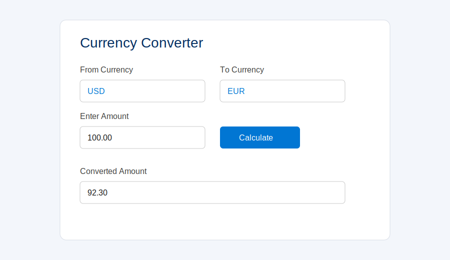

# CurrencyConverterComponent

Salesforce Lightning Web Component (LWC) for converting amounts between active org currencies using Salesforce `CurrencyType.ConversionRate` values.

## Screenshot



## How the component works

The UI and conversion logic are split across:

- **LWC**: `force-app/main/default/lwc/currencyConverter`
- **Apex service**: `force-app/main/default/classes/CurrencyConverterService.cls`

### Runtime flow

1. On load, the component calls `getActiveCurrencies()` to fetch active currencies.
2. It then calls `getOrgDefaultCurrencyIso()` to default **From Currency** (this method is currently hardcoded to return `USD`).
3. Users enter:
   - source currency (`From Currency`)
   - amount (`Enter Amount`)
   - target currency (`To Currency`)
4. Clicking **Calculate** calls `convertCurrency(amount, fromIso, toIso)`.
5. The result is shown in **Converted Amount** and can be copied with the copy icon.
6. The swap icon swaps source and target currency selections.

### Conversion formula

Rates are treated as relative to the org base currency:

```text
baseAmount = amount / fromRate
result     = baseAmount * toRate
```

Returned values are rounded to 2 decimal places.

## Component behavior details

- **Calculate button is disabled** until:
  - amount is present
  - amount is numeric and greater than 0
  - both currencies are selected
- **Errors**
  - UI shows `Failed to load currencies.` if currency list retrieval fails.
  - UI shows Apex error message when conversion fails.
- **Loading**
  - Spinner appears while conversion is in progress.
- **Copy to clipboard**
  - Copy icon copies converted value and briefly displays `Copied!`.
- **Rate source**
  - Uses configured Salesforce conversion rates, **not live market FX rates**.

## Where the component can be used

Defined in `currencyConverter.js-meta.xml`:

- `lightning__AppPage`
- `lightning__RecordPage`
- `lightning__HomePage`
- `lightning__UtilityBar`
